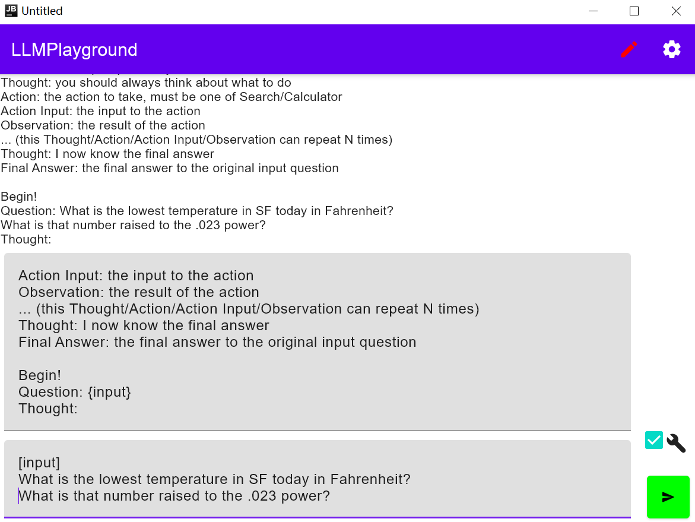

# LLM Playground
This is a simple kotlin compose multiplatform app for chatting with LLM, with configurable LLM settings.

highlights:
* Multiplatform supports android and desktop
* Code as minimum as possible
* Easy llm configurations. Just scan all your configs as QR and paste to llmConfigs, then save
* Error print to conversation as role "App"
* Proxy setting on both platforms

# Screenshots
 desktop chat 

 desktop setting 

 android chat 

 android setting 

# Reference
* [compose-multiplatform-template](https://github.com/JetBrains/compose-multiplatform-template)
* [compose-multiplatform/examples/chat](https://github.com/JetBrains/compose-multiplatform/blob/master/examples/chat)
